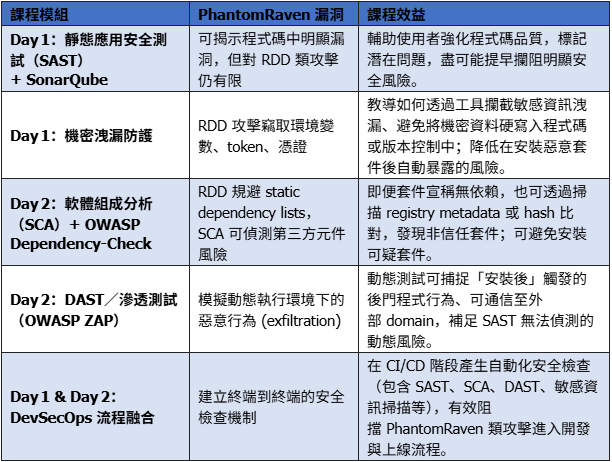

# DevSecOps 课程介绍&计划

## 课程介绍

本课程围绕 DevSecOps 理念，结合 VS/VSCode 工具链，介绍静态代码分析工具、依赖项安全扫描、机密泄漏防护等技术，并分享如何在开发流程中落实安全性，帮助开发者在开发流程中集成安全实践，实现开发、运维、安全一体化。

## 工具环境

- [Visual Studio](https://visualstudio.microsoft.com/downloads/)
    - 推荐 2026/2022 Community 版本
    - Community/Professional/Enterprise 择一即可（勾选【.NET 桌面开发】和【ASP.NET 与网页开发】工作负载，并在各个组件中启用 Roslyn 分析器；课程演示静态分析和整合 SonarLint 扩展需要此环境）

- [Microsoft .NET SDK 8.0](https://dotnet.microsoft.com/en-us/download/dotnet/8.0)
    - .NET 程序运行时
    - 提供示例项目编译与 SonarScanner for .NET 所需的 CLI（命令行工具）

- [Visual Studio Code](https://code.visualstudio.com/)
    - 轻量级 IDE（可用于 .NET、Java、JavaScript）
    - 安装 SonarLint 插件，以在轻量编辑器中实时检查代码质量与安全性

- [Java SE Development Kit 17.0.12](https://www.oracle.com/java/technologies/javase/jdk17-archive-downloads.html)
    - 提供 Java 运行时，用于本地运行 SonarQube
    - 可以先下载 zip 包，课程中指导安装配置

- [SonarQube Community Edition](https://www.sonarsource.com/products/sonarqube/downloads/) 和 [SonarScanner for .NET](https://docs.sonarsource.com/sonarqube-server/9.8/analyzing-source-code/scanners/sonarscanner-for-dotnet/)
    - 下载即可，课程中会指导安装。（本地 SAST 服务器建议通过 Docker 或 zip 包启动）以及将 .NET 项目分析结果上传到 SonarQube。

- [OWASP Dependency-Check CLI](https://owasp.org/www-project-dependency-check/)
    - 下载安装即可，课程中指导安装。（SCA 扫描工具，识别第三方组件中的已知漏洞）

- [OWASP ZAP](https://www.zaproxy.org/download/)
    - 下载即可，课程中指导安装。（DAST与渗透测试示范工具，执行基本攻击模拟）

- [Git for Windows](https://gitforwindows.org/) 以及 [gitleaks](https://github.com/gitleaks/gitleaks)
    - 需要一个 GitHub 账号（用于执行 GitHub Action/管道）
    - 下载即可，课程中指导安装。（版本控制与机密泄露扫描工具组，用于教学情境中的凭证检测）

## 课程大纲

1. DevSecOps 基础理念与安全开发流程
2. VS/VSCode 环境配置及主流安全插件推荐（如 SonarLint、gitleaks 等）
3. 静态应用安全测试（SAST）原理与工具实践（SonarQube、Roslyn 分析器）
4. 依赖项安全扫描与第三方组件漏洞检测（OWASP Dependency-Check）
5. 动态应用安全测试（DAST）与渗透测试演示（OWASP ZAP）
6. 机密泄漏防护与凭证检测流程（gitleaks 等工具）
7. 自动化安全检测与持续集成实践（安全管道构建）
8. 代码提交与安全检测的最佳实践

## Day 1 课程计划

**主题：DevSecOps 理念与安全开发环境实践**

- 代码安全与 DevSecOps 基础理念
- VS/VSCode 安全插件及 lint 工具实操
- 集成 SonarQube 等静态代码分析工具，提升 .NET 项目代码质量与安全性
- 机密泄漏防护：凭证检测与安全提交流程规范
- 静态应用安全测试（SAST）原理与实战演练

- 实践：提交代码并进行安全扫描

## Day 2 课程计划

**主题：自动化安全检测与持续集成实践**

- 软件组成分析（SCA）：识别不安全的第三方套件
- 使用 OWASP（Open Web Application Security Project）Dependency-Check 工具进行依赖项扫描
- 渗透测试与动态应用安全测试（DAST）概念
- 使用 OWASP ZAP 工具进行简易渗透测试
- 案例分享：如何在 VS 及 VS Code 项目中导入安全性检测流程

- 安全事件响应与日志审计
- 实践：构建安全管道并自动化漏洞检测

## 课程重点

- 如何在 VS/VSCode 中集成安全工具
- 自动化安全扫描流程演示
- 代码提交与安全检测的最佳实践
- DevSecOps 流程中的常见问题与解决方案

## 综合效益

- 提升开发团队安全意识
- 降低安全风险与漏洞发生率
- 加快安全合规流程
- 实现安全左移，减少后期修复成本

## 附：初始计划

