# SonarQube 集成到开发管道（GitHub）

## 引言
在现代软件开发中，代码质量至关重要。随着开发团队的规模和复杂度的增加，使用工具来监测和提高代码质量变得愈发重要。SonarQube 作为一个流行的代码审查工具，与 GitHub 的集成能够帮助开发者及时发现并修复代码中的问题。

## SonarQube 简介

### 什么是 SonarQube？
SonarQube 是一个开源平台，主要用于代码质量管理和持续检测。它可以分析代码并提供有关代码质量的详细报告，包括代码的**复杂度、重复率、安全漏洞**等。

### SonarQube 的主要特性

- **支持多种编程语言**：SonarQube 支持多达 27 种编程语言，包括 Java、C#、JavaScript 等。
- **可视化报告**：提供直观的代码质量指标，使开发者能够快速了解项目状况。
- **集成 CI/CD 工具**：能够与多个持续集成工具（如 Jenkins、Travis CI 等）无缝集成。
- **自动检测安全漏洞**：可以帮助团队及时发现安全隐患。

## GitHub 简介

### 什么是 GitHub？
GitHub 是一个基于云的代码托管平台，使用 Git 作为版本控制系统。它允许开发者协作、管理项目及跟踪代码的更改。

### GitHub 的主要特性

- **版本控制**：便于团队管理代码更改和版本历史。
- **协作**：支持多人协作开发，提供 Pull Requests、Issues 等功能。
- **社区支持**：拥有丰富的开源项目和社区支持。

## SonarQube 与 GitHub 的集成

### 为什么集成 SonarQube 与 GitHub？
通过将 SonarQube 集成到 GitHub 中，开发团队可以在每次代码提交时自动进行代码质量检查，从而在开发早期发现问题。

***

## 本地安装 SonarQube（Server）
相对于 SonarSource 官方提供的在线托管服务（SonarQube Cloud，原 SonarCloud），其还提供了本地安装版本（可部署在个人/企业、本地/内网环境）

> [SonarQube Server download](https://www.sonarsource.com/products/sonarqube/downloads/)，下载最新版本

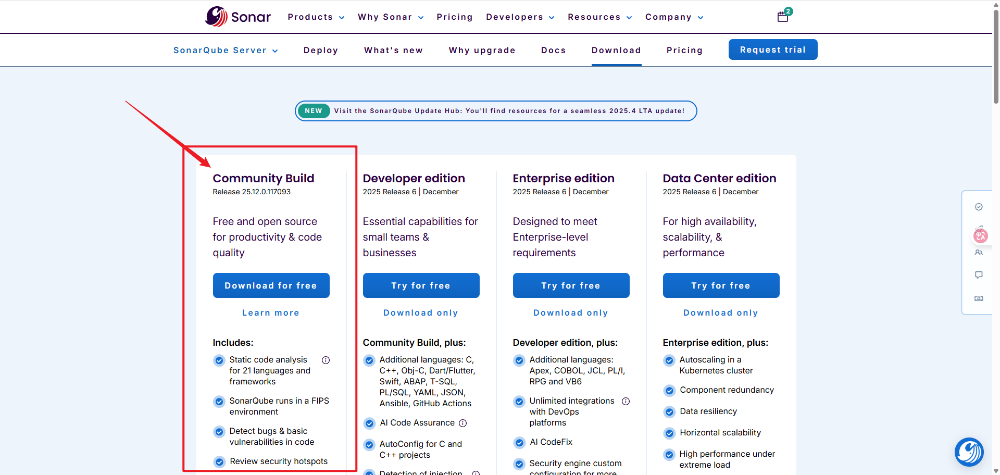

### 1、本地安装 Java JDK 17（用于运行 SonarQube Server）

- 下载地址：<https://www.oracle.com/java/technologies/javase/jdk17-archive-downloads.html>

将 zip 包下载到本地之后，解压缩包比如放置于 `C:\Program Files\Java`

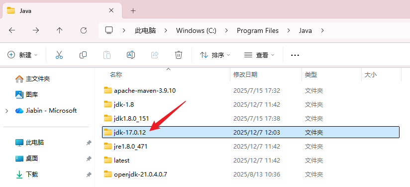

打开系统设置 -> 环境变量

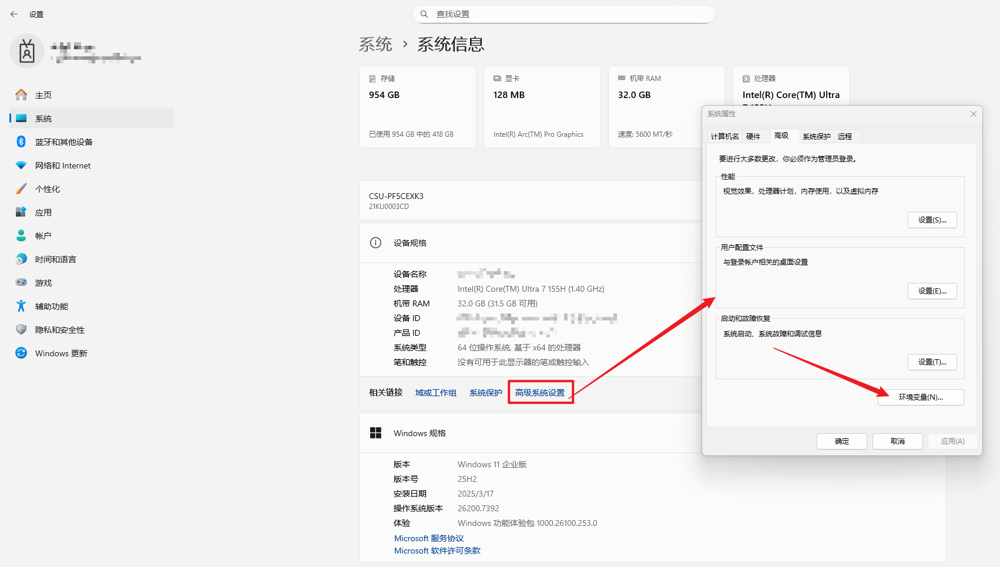

在环境变量中添加 `JAVA_HOME` 并设置值为上一步解压后的文件夹路径（此处为 `C:\Program Files\Java\jdk-17.0.12`）

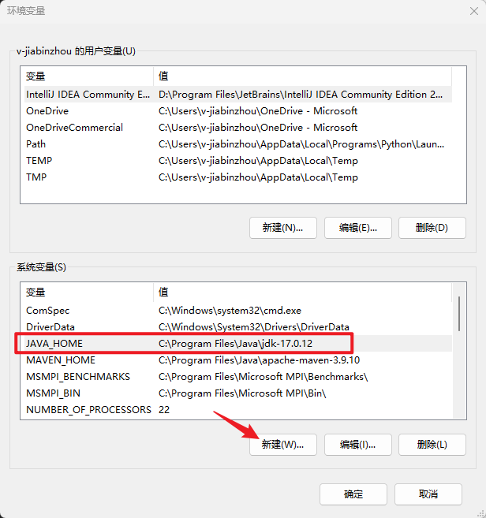

编辑 `Path` 环境变量，添加 `%JAVA_HOME%\bin` 到其中

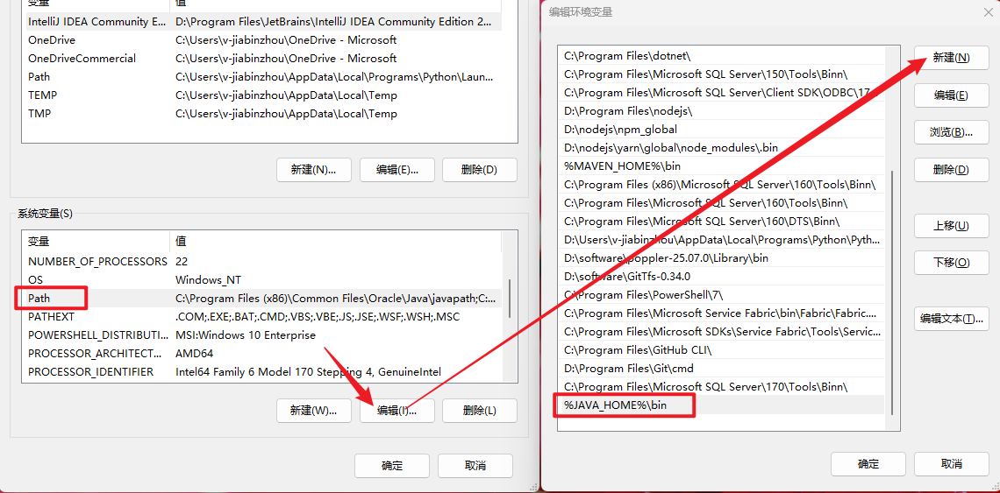

此时，打开 PowerShell/CMD，输入 `java -version`，能看到当前系统已经安装配置的 Java 版本

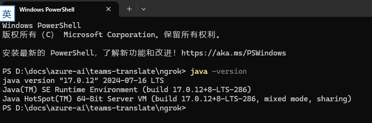

### 2、配置 SonarQube Server

将 SonarQube Community 的安装包（zip）下载并解压到本地后（比如：`D:\software\sonarqube-25.11.0.114957`），打开其配置文件 `conf/sonar.properties`（此处为 `D:\software\sonarqube-25.11.0.114957\conf\sonar.properties`），该文件定义了 SonarQube 的诸多属性（比如数据库连接信息）

我们将 `sonar.embeddedDatabase.port=9092` 取消注释，表示使用内嵌的 H2 数据库（无需单独安装数据库管理工具，即可使用）。如果你本地之前已经装有 MySQL/SQL Server，也可以取消掉相应的配置信息，以使 SonarQube 连接到这些数据库（注意：不建议在生产环境使用内嵌的 H2 数据库，H2 仅用于个人测试、演示使用）

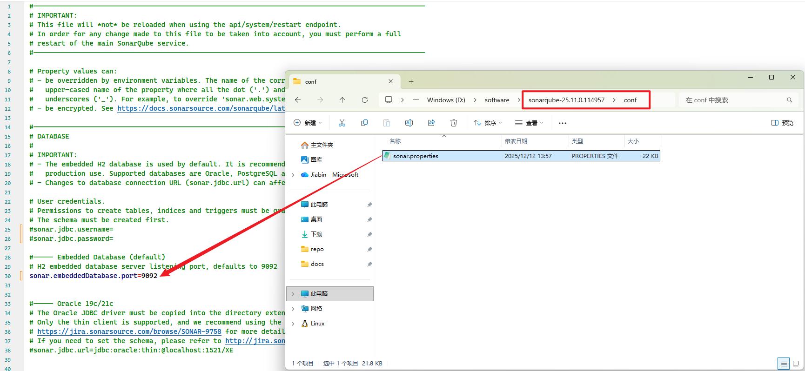

### 3、启动 SonarQube Server

定位到 SonarQube Server 的 `bin\windows-x86-64` 目录（如果是其他操作系统可以定位到相应目录），在当前文件夹打开命令行工具（比如：PowerShell）

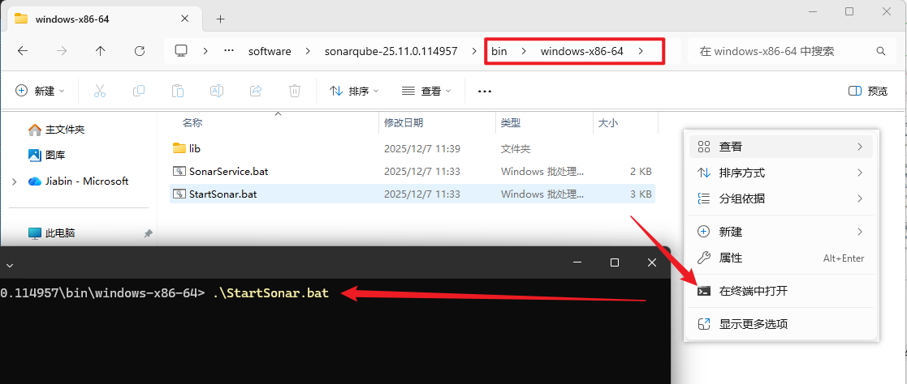

执行 `./StartSonar.bat`，以启动 SonarQube Server。启动成功截图如下

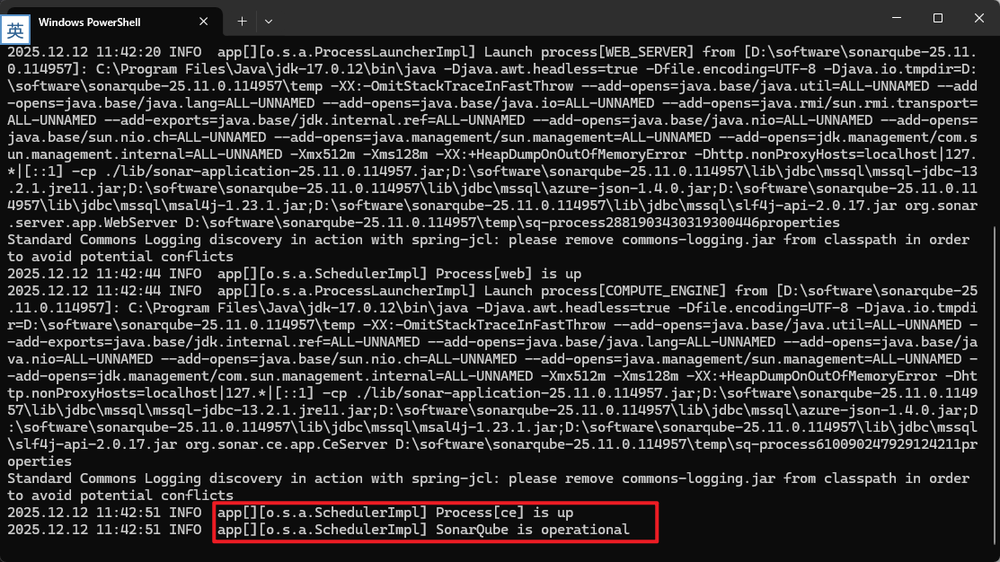

注意：若启动失败，可查看 `\logs` 文件夹下的日志文件以定位失败原因（比如：`\logs\web.log`）

### 4、浏览 SonarQube 页面

打开浏览器，定位到 <http://localhost:9000>，输入用户名/密码（初始账号+密码都是 admin，登录后需重置密码），登录后查看了解 SonarQube 的主要功能

- 质量门（Quality Gate）自动判定
- 代码安全检测（Security + Hotspots）
- 可靠性检查（Reliability）
- 可维护性检查（Maintainability / Code Smells）
- 代码重复率检测（Duplications）
- 测试覆盖率统计（Coverage）
- 新增代码与全量代码的质量对比（New Code / Overall Code）
- 可视化分析仪表盘（Overview、Measures、Activity）
- 问题管理（Issues 管理、规则、分配）

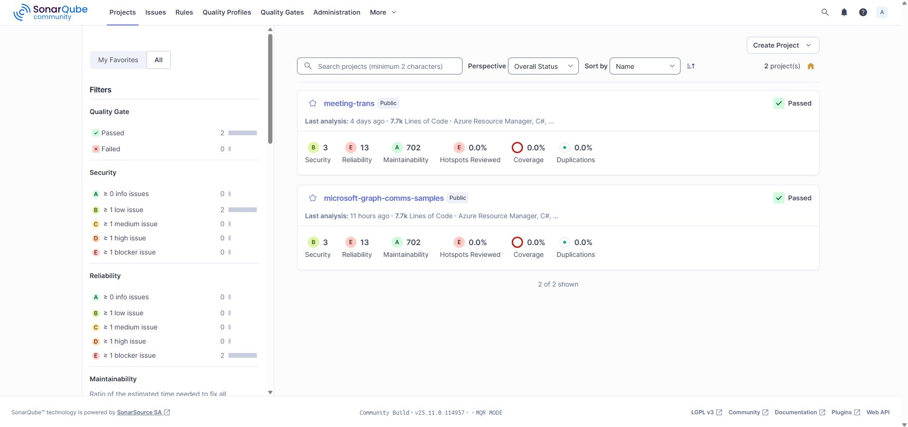

***

## 使用 SonarQube 扫描本地项目

### 1、创建本地项目

如图，先创建一个本地项目（读取本地代码）

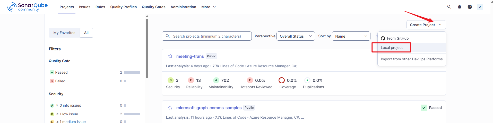

填写项目名称（key、branch 使用自动生成的即可），然后下一步

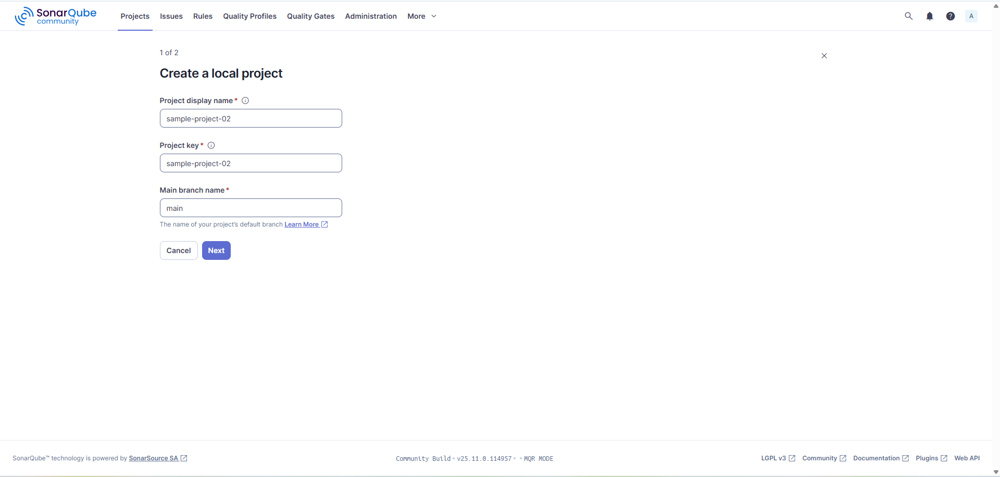

选择默认的配置即可（当然你可以选择自定义的规则），点击【Create project】

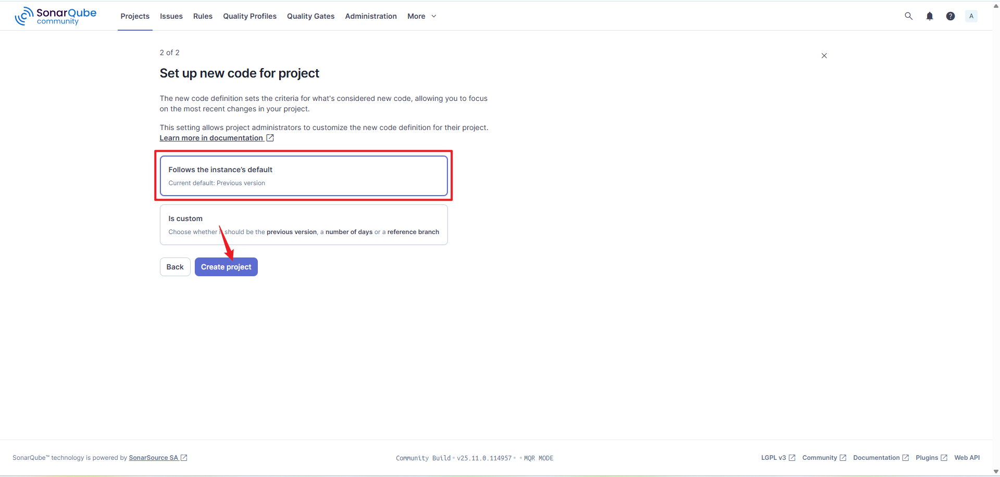

### 2、配置项目

创建项目完成后，会弹出 `Analysis Method` 页面，选择 `Locally`

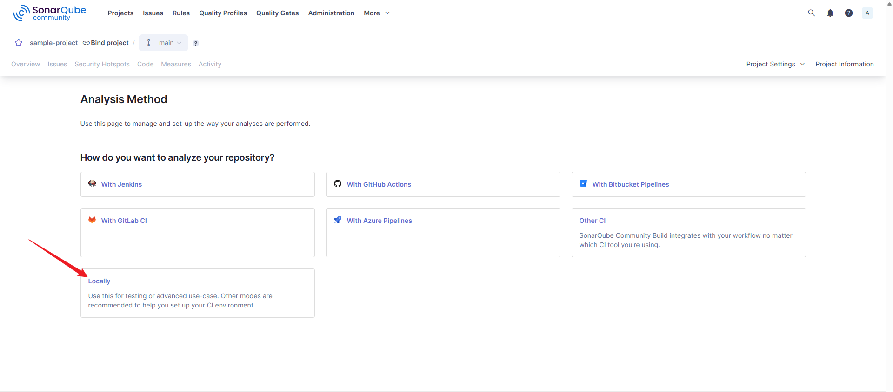

生成项目密钥（使用默认填充的信息即可），直接点击【Generate】

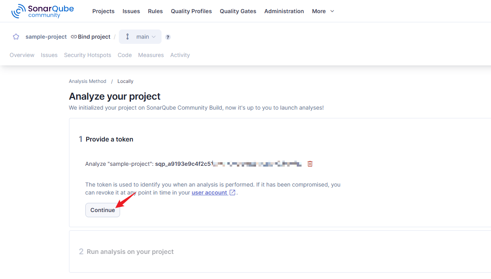

根据你的代码情况，选择合适的分析步骤（此处以 .NET 为例。如果你的代码是其他框架比如 Java，可以选择相应的 Tab - Maven），根据提示执行相应的命令

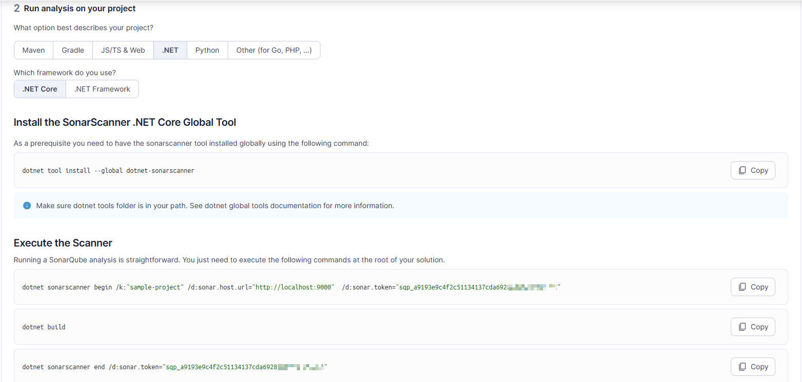

### 3、查看项目代码检查结果

按照上述步骤对项目代码执行了分析并上传到 SonarQube Server 后，就可以在页面中查看代码的各维度指标。也可以进到具体的维度 Tab 查看列表、详情

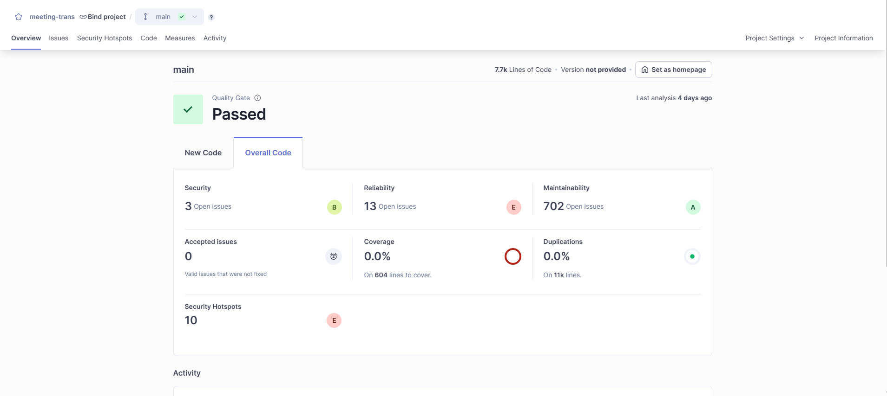

***

## 将 SonarQube 集成到 GitHub Action

除了在本地手动执行代码分析并上传到 SonarQube Server 之外，还通过将 SonarQube 集成到 GitHub 中，这样开发团队可以在每次代码提交时自动进行代码质量检查，从而在开发早期发现问题

### 1、在 GitHub 创建应用

> 详细步骤链接：<https://docs.sonarsource.com/sonarqube-community-build/devops-platform-integration/github-integration/setting-up-at-global-level/setting-up-github-app>

打开 GitHub，并打开个人设置 Settings

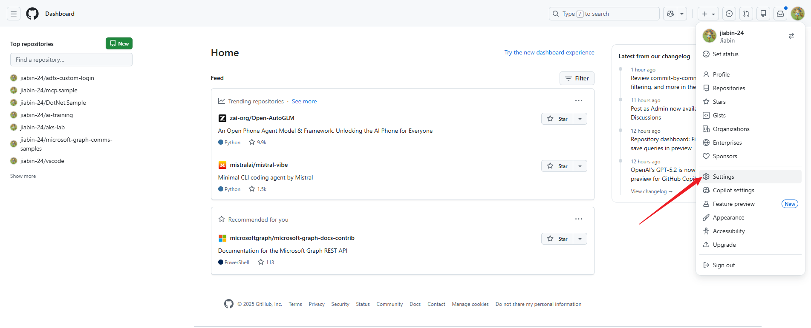

在设置的最底部，点击【Developer settings】，再新创建一个“GitHub App”

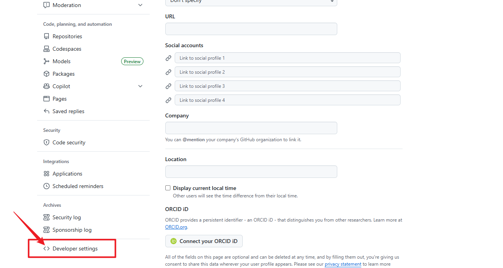

填写以下信息（以自己的情况为准）：
- GitHub App name：SonarQube Integration Local
- Homepage URL：http://localhost:9000
- Callback URL：http://localhost:9000
- Webhook：可以取消掉（反选 Active）

生成 Client Secret、Private Key 并及时保存下来

针对 Permissions，选择以下权限

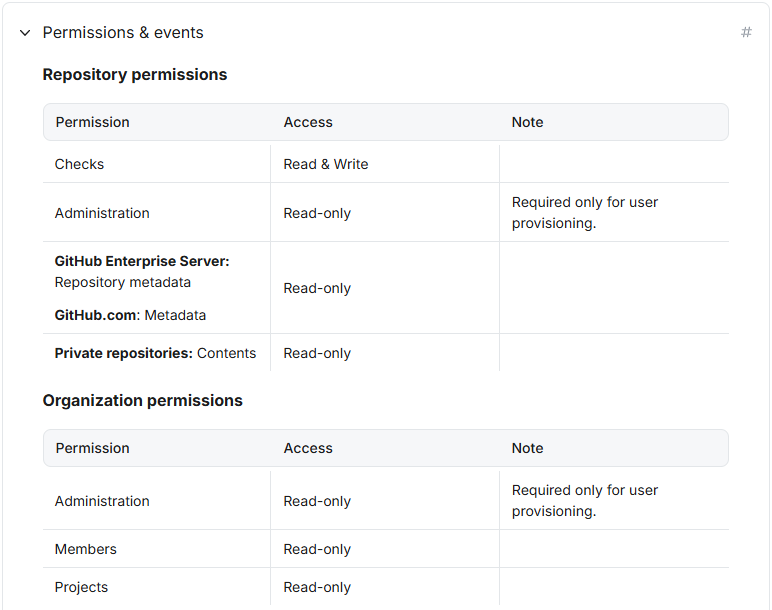

点击【Create GitHub App】，创建完成之后再点击安装该 App

### 2、在 SonarQube Server 配置连接 GitHub 信息

在 SonarQube 的页面上创建新项目，选择 GitHub，若是初次创建 GitHub 的项目，会出现配置页面。后续也可以在 `Administation -> Configuration -> DevOps Platform Integrations` 中再次打开

依次填入 GitHub App 的相关信息

- Configuration name：sonar-local-github（可以任意名字）
- GitHub API URL：https://api.github.com
- GitHub App ID：从 GitHub App 中获取
- Client ID：从 GitHub App 中获取
- Client Secret：上面步骤生成
- Private Key：上面步骤生成

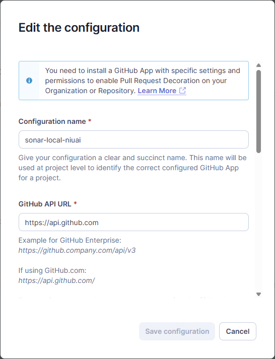

配置完成后，就可以检索你的 GitHub 中的仓库，选择其中的项目，导入到 SonarQube Server 中来（注意：此时项目还没有代码相关的检查信息，需要进一步配置 GitHub Action）

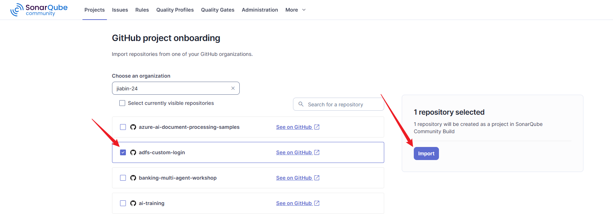

### 3、将 SonarQube 集成到 GitHub Action 管道中

在创建出的项目 - Analysis Method 中，选择【With GitHub Actions】

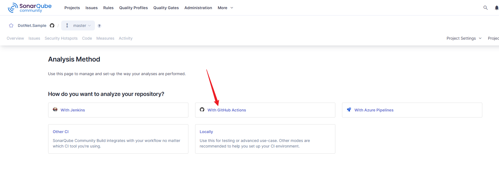

根据弹出的页面提示，完成管道的配置

- 生成仓库的配置
- 针对具体代码（语言），添加不同的 action yaml 文件

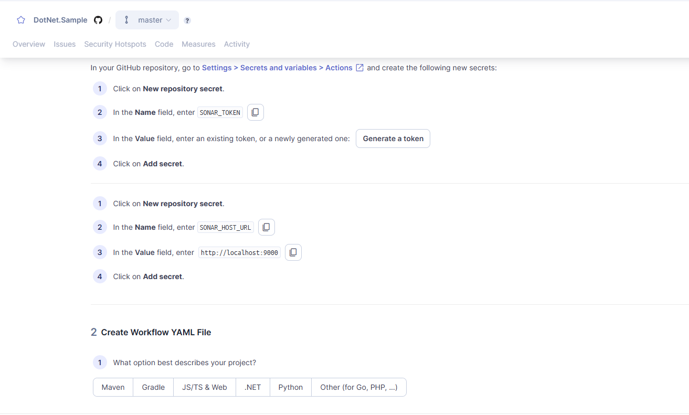

### 4、映射本地端口到 Internet

由于 SonarQube Server 安装在本地，Internet 没办法访问，即 GitHub Action 中的具体执行步骤，无法将 SonarQube 的扫描结果上传到本地的 SonarQube Server。此时可以使用 .NET 的 DevTunnel 或者 [ngrok](https://ngrok.com/)（需注册）将本地 IP 穿透到 Internet

这里以 ngrok 为例

```yaml
version: "3"
agent:
  authtoken: xxx
tunnels:
    githubApp:
        addr: http://localhost:9000
        proto: http
```

执行 `ngrok start --all --config ngrok.yml`，然后在 GitHub Repo 的 secret 中，`SONAR_HOST_URL` 配置成该域名

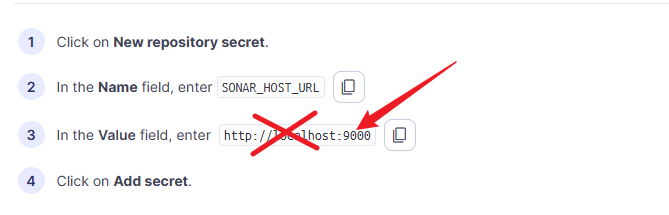

### 提交代码，或者手动构建 GitHub 管道

将代码扫描结果随每次代码提交，上传到 SonarQube Server

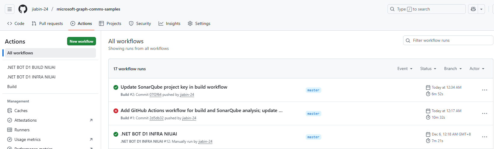