# OWASP ZAP 实践教程

## 概述

**OWASP ZAP** 是 OWASP 旗下最广泛使用的 **动态应用安全测试（DAST）工具**，开源、免费、跨平台，适用于开发者、安全工程师、QA 等不同角色。它通过作为 中间代理（Proxy） 拦截浏览器与 Web 应用之间的流量，实现漏洞检测。

## 核心功能

- 拦截代理（Intercepting Proxy）：可查看、修改请求/响应。
- 自动化扫描（Active / Passive Scan）：
    - Passive Scan：不修改流量，仅分析弱点，安全但覆盖有限。
    - Active Scan：主动发送 payload，能发现更多漏洞，但具有入侵性。
- Spider & AJAX Spider：爬取网站结构，包括 SPA 应用。
- Fuzzer：发送异常参数测试应用鲁棒性。
- Forced Browsing：自动探测隐藏路径。
- WebSockets 支持、脚本扩展、多语言插件体系（Marketplace）。

## 下载安装

> 下载地址：<https://www.zaproxy.org/download/>

下载到本地后双击 `ZAP_2_17_0_windows.exe` 执行安装（以 Windows 系统为例）。安装完成后打开该应用

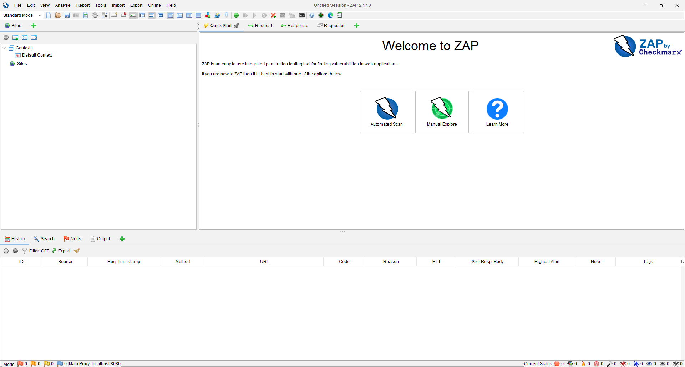

## 实践步骤

### Exercise 1 自动扫描（Automated Scan）

点击“Automated Scan”进入自动扫描配置界面，只需要配置待攻击的网址，然后点击“Attack”执行傻瓜式的渗透测试。（自动扫描无需配置代理）

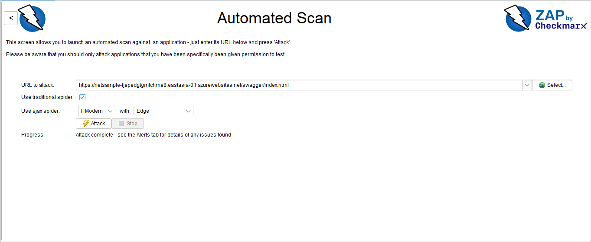

自动扫描结束后可点击“Alerts”（警报） 查看漏洞信息。

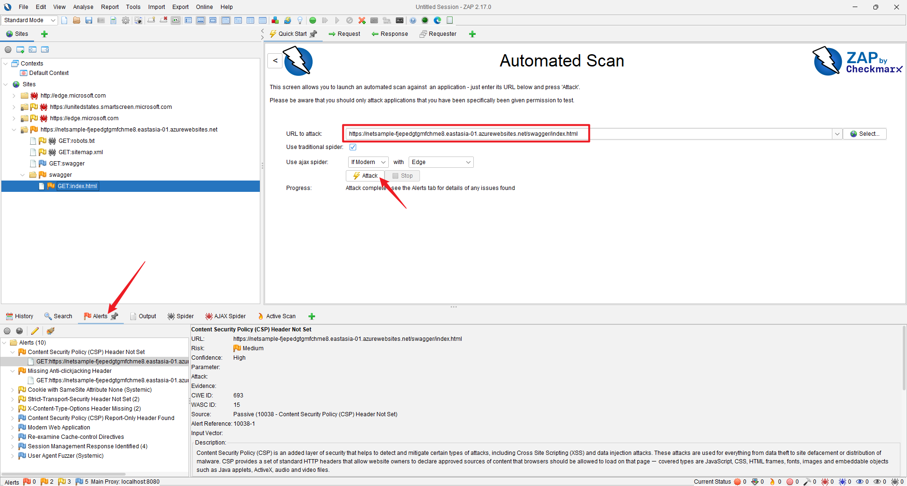

### Exercise 2 审查和分析扫描结果

Steps:

1. 一旦以上的扫描完成，导航到 OWASP ZAP 中的“Alerts”选项卡。
2. 查看按严重性分类的已识别漏洞列表。
3. 点击每个漏洞以查看详细信息，包括描述、风险级别和建议的修复步骤。
4. 通过导航到“Report” > “Generate Report...”，选择所需的格式（例如 HTML、XML）来生成扫描报告。

查看 Alerts
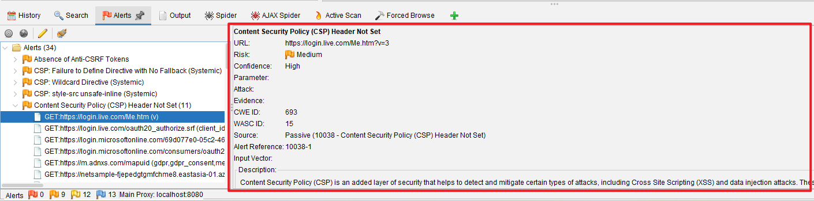

生成报告
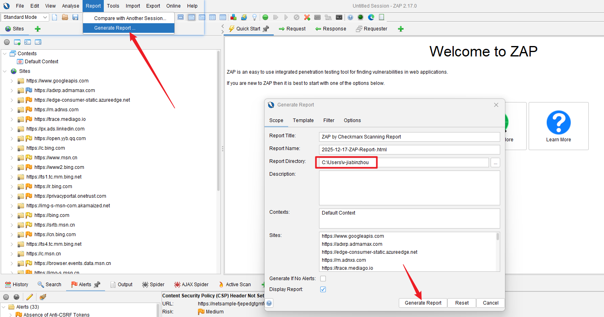

查看生成的报告
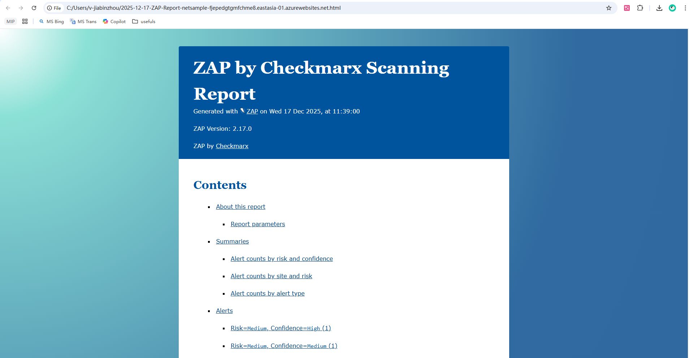

### Exercise 3 手动扫描（Manual Explore）

由操作者执行页面访问，ZAP 不会主动发送恶意请求，只分析已有流量

点击 Manual Explore（手动扫描）进入手动扫描配置界面，输入要测试的网址，点击启动浏览器。之后会启动指定的浏览器并打开对应页面，操作者可在浏览器中继续执行后续步骤，ZAP 会对访问行为一一记录并分析

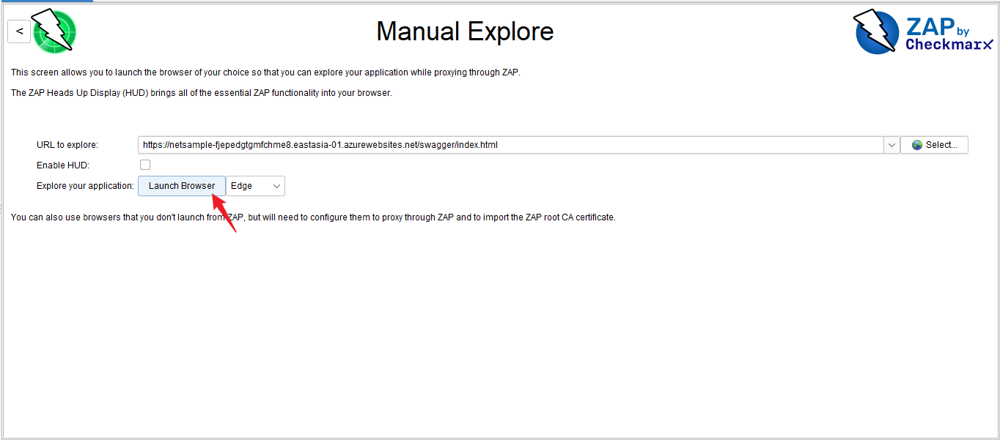

同时可结合 ZAP 的已有功能，右键具体站点 -> Attack -> 选择 “Forced Browse Site”、“Forced Browse Directory”、“Forced Browse Directory(and Children)” -> 选择默认的 directory-list-1.0.txt 目录字典进行尝试爬取。

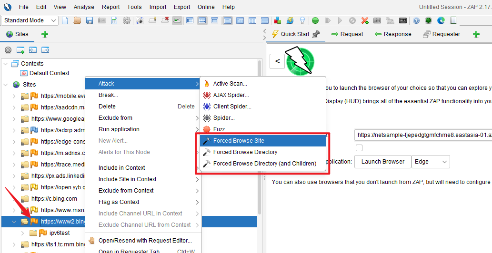

#### 附：通过配置代理的方式执行手动扫描

若不通过 ZAP 启动浏览器的方式，还可以通过配置代理的方式，以 Chrome 为例。打开其代理配置

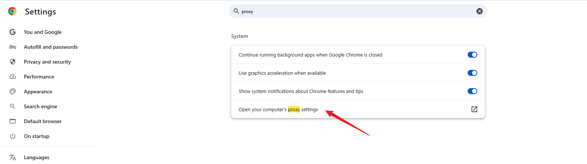

之后会跳转到系统的代理配置，按下图进行配置并保存（localhost:8080 是 ZAP 默认的代理）

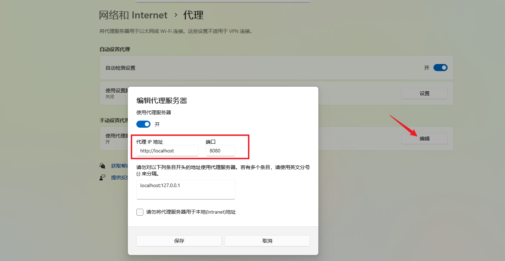

此时，在 Chrome（包括系统的其他应用）中浏览网页都会被 ZAP 捕获并进行记录分析（漏洞）

> 注意：分析完成后记得将系统代理关闭

### Exercise 4 主动扫描（Active Scan）

Steps:

- 在 OWASP ZAP 界面中，在“站点”选项卡下右键点击目标网站。
- 选择“Attack”，然后选择“Active Scan”。
- 配置扫描设置并开始扫描。
- 在“Active Scan”选项卡中监控主动扫描的进度。

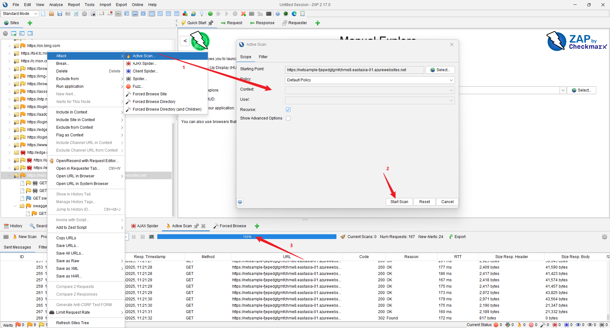

### 后续

- 拦截请求：在代理模式中，可以将浏览器访问的请求先进到 break 里。修改参数后点击右向箭头会放行并向服务器提交改造后的请求参数
- 重放攻击
- 暴力破解
