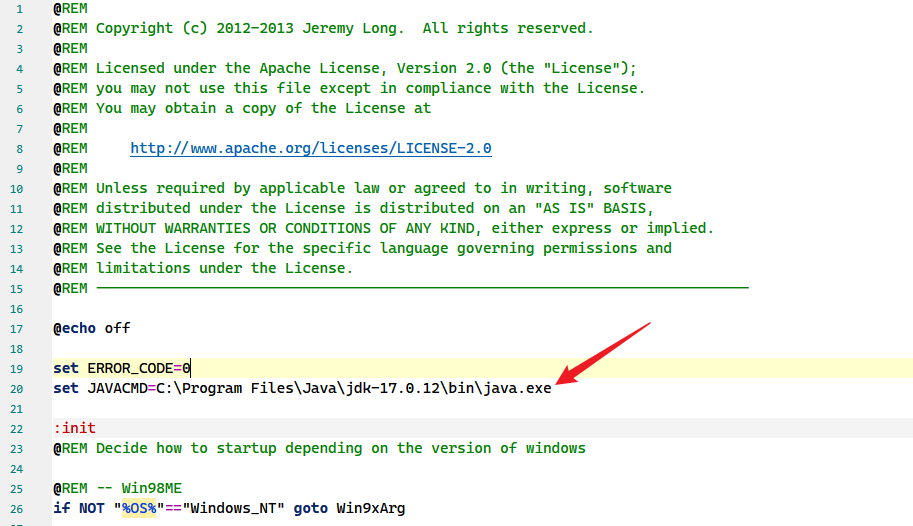
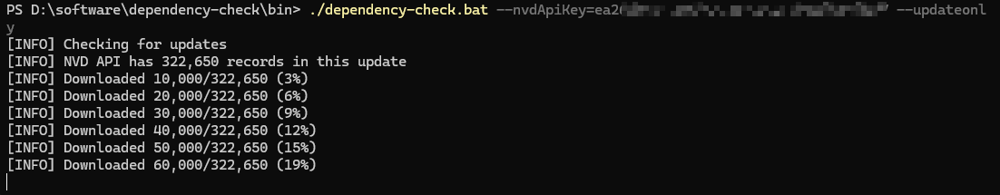
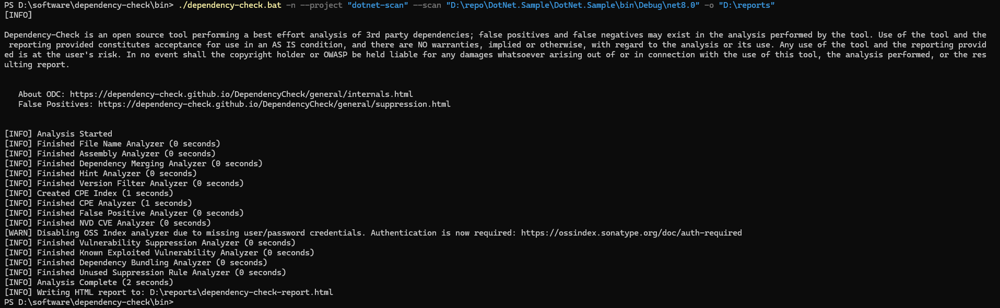
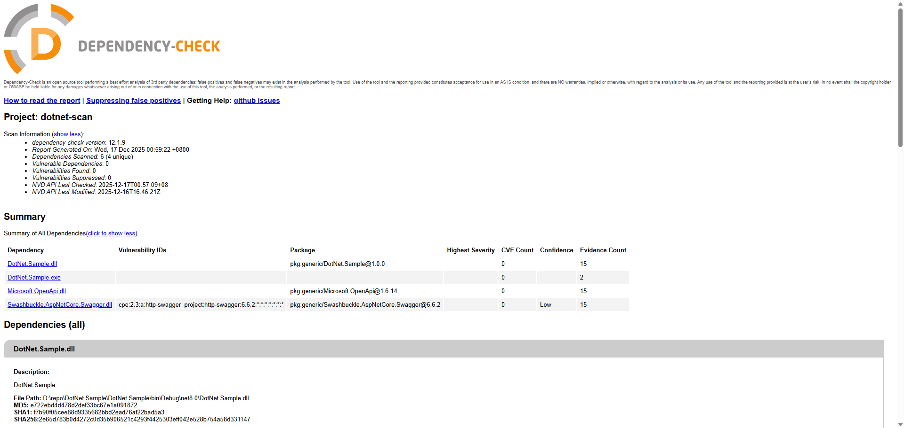

## Dependency-Check 入門

### 概述
Dependency-Check 是 OWASP（Open Web Application Security Project）的一個實用開源程式，用於識別專案相依項並檢查是否存在任何已知的、公開揭露的漏洞。目前，已支援 Java、.NET、Ruby、Node.js、Python 等語言編寫的程式，並為 C/C++ 建構系統（autoconf 和 cmake）提供有限的支援。而且該工具還是 OWASP Top 10 的解決方案的一部分。

Dependency-Check 支援面廣（支援多種語言）、可整合性強，作為一款開源工具，在多年來的發展中已經支援和許多主流的軟體進行整合，比如：命令列、Ant、Maven、Gradle、Jenkins、Sonar 等；具備使用方便、落地簡單等優勢。

### 實現原理
依賴性檢查可用於掃描應用程式（及其相依庫），執行檢查時會將 Common Platform Enumeration（CPE）國家漏洞資料庫及 NPM Public Advisories 庫下載到本地，再透過核心引擎中的一系列分析器檢查專案相依性，蒐集有關相依項。

### NVD 概述
Dependency-Check 依賴 NVD 漏洞資料庫（美國國家通用漏洞資料庫）進行相依漏洞檢查（全球資訊安全領域著名的漏洞資料庫包括中國國家資訊安全漏洞庫、美國國家資訊安全漏洞庫 NVD，賽門鐵克漏洞庫等等）官網：<https://nvd.nist.gov/>

NVD 的更新頻率是發生問題即時更新，具體連結：<https://nvd.nist.gov/general/nvd-dashboard>

### 具體使用步驟

#### 1. 下載 Command Line 並解壓到本地
下載地址：<https://owasp.org/www-project-dependency-check/>

#### 2. 申請 NVD API Key
若沒有該 API Key，在下載 NVD 資料庫時會很慢（即使有該 Key，大概也要一個小時）：
```
[WARN] An NVD API Key was not provided - it is highly recommended to use an NVD API key as the update can take a VERY long time without an API Key
```

申請地址：<https://nvd.nist.gov/developers/request-an-api-key>

#### 3. 配置 JDK 環境

打開 `dependency-check\bin\dependency-check.bat`，添加配置
```bash
set JAVACMD=C:\Program Files\Java\jdk-17.0.12\bin\java.exe
```



#### 4. 下載 NVD 資料庫
執行以下命令
```powershell
dependency-check.bat --nvdApiKey=your_api_key_here --updateonly
```



#### 5. 掃描打包應用並生成報告

OWASP Dependency-Check 並不依賴某種語言的建構系統，它可以直接掃描
- .dll
- .exe
- .nupkg
- .deps.json
- 目錄（包含以上檔案）

##### Java
```bash
dependency-check.bat -n --failOnCVSS 7 --project "unisystem" --scan "D:\\jars\app.jar" -o "D:\\reports"
```

- -n：是不更新掃描
- --failBuildOnCVSS：表示失敗的告警閾值，不影響掃描結果。透過設定合理的閾值，開發者可以確保他們的專案不會因為包含高風險漏洞的相依而建置成功，進而避免潛在的安全風險
- --project：用來指定掃描報告中顯示的「專案名稱」，不會影響掃描邏輯本身（會出現在生成的 HTML、JSON 等報告中，用作報告標題）

##### .NET
```bash
dependency-check.bat -n --project "dll-scan" --scan "D:\dotnet-app\MyLib.dll" -o "D:\reports"
```

.NET 還可以掃描 .exe、.deps.json（推薦） 甚至是包含以上檔案的目錄



#### 6. 檢視報告



- dependency-check version（工具版本）：12.1.9
- Report Generated On（報告生成時間）：Wed, 17 Dec 2025 00:59:22 +0800
- Dependencies Scanned（相依項掃描數）：6 (4 unique)
- Vulnerable Dependencies（有漏洞的相依項數）：0
- Vulnerabilities Found（總計漏洞數）：0
- Vulnerabilities Suppressed（抑制的漏洞數）：0（抑制的漏洞指的是在掃描過程中，被工具識別並且被使用者或配置檔明確忽略的漏洞數量。這些被「抑制」的漏洞不會出現在最終的報告中）

| Dependency | Vulnerability IDs | Package | Highest Severity | CVE Count | Confidence | Evidence Count |
|------|------|------|------|------|------|------|
| 代表存在漏洞的相依項 | 代表對應NVD的漏洞ID | 代表相依中的套件 | 代表漏洞的嚴重程度 | 代表與相依套件與漏洞關聯的數量 | 代表工具對漏洞檢測結果的置信度 | 代表支援該漏洞檢測結果的證據數量|

##### CVSS 概述
NVD 評級依賴 CVSS（CommonVulnerability Scoring System），即「通用漏洞評分系統」，是一個「產業公開標準，其被設計用來評估漏洞的嚴重程度，並幫助決定所需反應的緊急度和重要度，具體評分標準如下：

1. **CRITICAL**（9.0 - 10.0）：這些漏洞通常具有最高的嚴重性，可能導致遠端程式碼執行、大規模資料外洩、系統完全被攻陷等影響。應立即修復或採取其他補救措施。
2. **HIGH**（7.0 - 8.9）：這些漏洞可能會導致重大安全問題，如資料外洩、拒絕服務攻擊等。應盡快修復。
3. **MEDIUM**（4.0 - 6.9）：這些漏洞可能會導致中等程度的安全問題，但利用難度較大或者影響範圍有限。雖然不需要緊急處理，但應在合理的時間內修復。
4. **LOW**（0.1 - 3.9）：這些漏洞通常不會造成重大影響。可以在日常維護過程中進行修復。
5. **NONE**（0）：無問題。

##### Dependency-Check 報告漏洞劃分標準
Dependency-Check 對漏洞嚴重程度判定有四檔分別為：

1. **CRITICAL**：這些漏洞通常會導致非常嚴重的後果，如遠端程式碼執行、大規模資料外洩等。應優先處理。
2. **HIGH**：高危漏洞可能導致嚴重的後果，但不一定能直接被利用。也應盡快修復。
3. **MEDIUM**：中等風險漏洞可能會導致較大的安全問題，但利用難度較大或影響範圍有限。
4. **LOW**：低風險漏洞一般不會造成重大影響，但在有餘力的情況下也應考慮修復。

---

### 參考文件

- [安全元件掃描工具 owasp/dependency-check 使用](https://www.cnblogs.com/allay/p/18735876)
