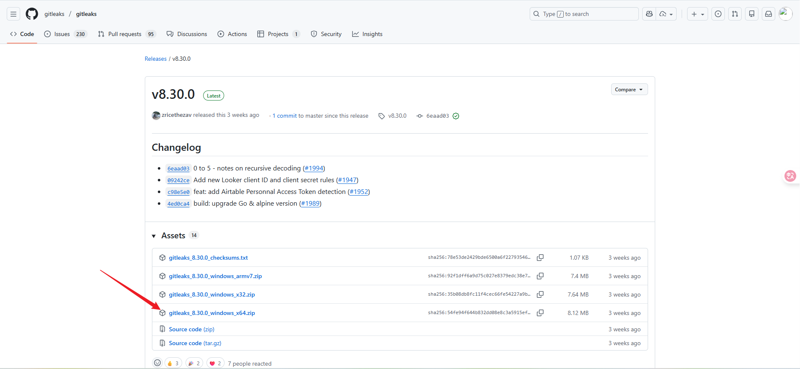
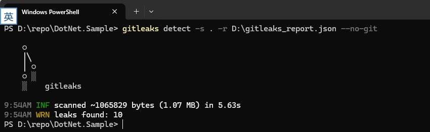
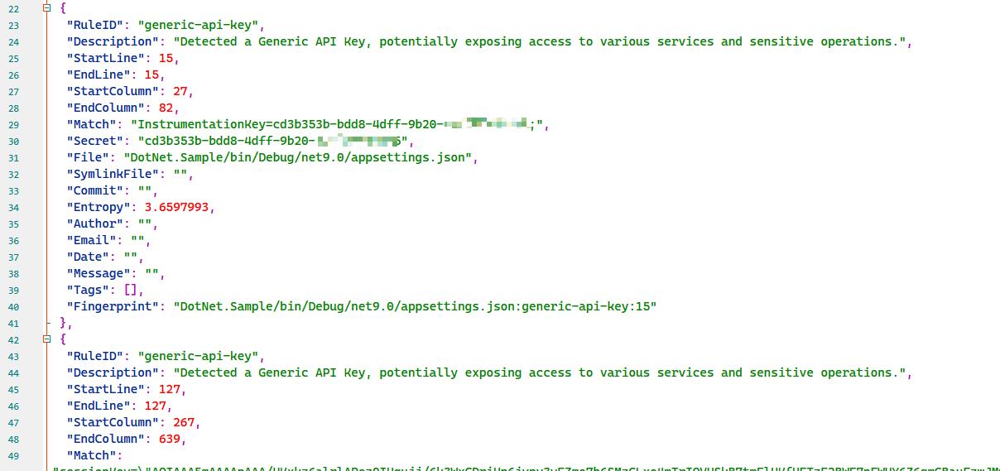
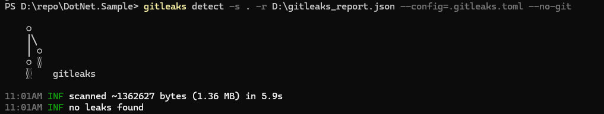

## Gitleaks 實作教學

### 概述

Gitleaks 是一款開源的敏感資訊/金鑰洩露掃描工具（Secret Scanner），用於在 Git 倉庫、檔案目錄、提交歷史中發現硬編碼的敏感資料，例如：

- API Keys
- 密碼
- Token
- 憑證
- 資料庫連線字串
- 私鑰等

它是一種 SAST（Static Application Security Testing）靜態安全分析工具，可整合到日常開發流程、CI/CD、pre-commit hook 中，用來阻止敏感資訊被提交到倉庫。

### 下载安装

> GitHub 地址：<https://github.com/gitleaks/gitleaks>

在 Releases 中選擇最新的版本，展開並點選 `gitleaks_x.x.x_windows_x64.zip`（此處以 Windows 為例）



下載並解壓到本地目錄後，可以將其加入系統環境變數（可選），執行以下命令以驗證安裝完成
```bash
gitleaks --version
```

### 機密掃描

常見使用方式範例

#### 掃描本機資料夾

```bash
gitleaks detect -s D:\workspace\xxx -r D:\gitleaks_report.json --no-git
```

- -s：原始碼路徑
- -r：報告輸出路徑，預設為 json 格式
- --no-git：不以 Git 倉庫方式掃描，而是直接掃描檔案系統中的檔案，不會讀取 Git 歷史、commit、diff 等內容



檢視輸出的 JSON 檔案



### 自訂設定 .gitleaks.toml

`.gitleaks.toml` 是 Gitleaks 的設定檔，用於自訂掃描規則、允許清單、排除路徑、增加 regex、調整預設規則等。

它能幫助你：

- 控制掃描行為
- 減少誤報（false positives）
- 新增自訂敏感資訊規則
- 設定忽略目錄/檔案/正規表達式

Gitleaks 官方文件說明：設定檔支援

- 預設規則擴充
- paths allowlist
- 自訂 regex

典型結構：
```yml
title = "gitleaks config"

[extend]
useDefault = true   # 是否繼承預設規則

[allowlist]
paths = [
  '''(.*?)test(.*?)''',   # 忽略哪些路徑
]

regexTarget = "line"      # 匹配方式：line,file,secret
regexes = [
  '''client_id''',        # 忽略匹配這些內容
]

[[rules]]
id = "custom-api-key"
description = "自訂 API Key 規則"
regex = '''(?i)(api_key|apikey|api-secret)\s*=\s*[0-9a-zA-Z_-]{16,}'''
entropy = 2.5
```

#### 如何啟用自訂的 .gitleaks.toml

實作步驟：
1. 忽略某些目錄（如測試目錄）
```yml
[allowlist]
paths = [
  '''(.*?)test(.*?)'''
]
```

2. 忽略某些關鍵字（減少誤報），例如你的程式碼裡出現大量 client_id，但它並非秘密：
```yml
[allowlist]
regexTarget = "line"
regexes = [
  '''client_id''',
  '''secret_name''',
]
```

掃描時啟用該設定
```bash
gitleaks detect --config=.gitleaks.toml
```



### 後續

1. 結合 pre-commit（建議）或原生 Git hook，在本機程式碼提交前進行機密掃描
2. 整合到 DevOps 流程中，在程式碼合併到主分支時進行機密掃描（若掃描偵測到機密則攔截 PR）

### 參考文件

- [Gitleaks完整指南：5分鐘掌握代碼安全檢測神器](https://blog.csdn.net/gitblog_00207/article/details/155877130)
